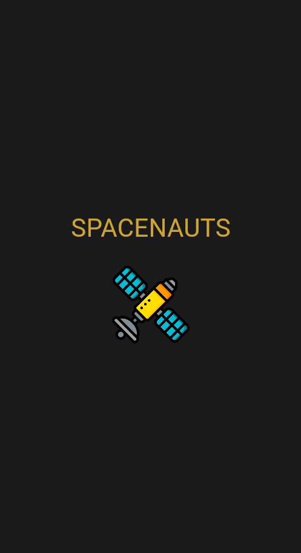
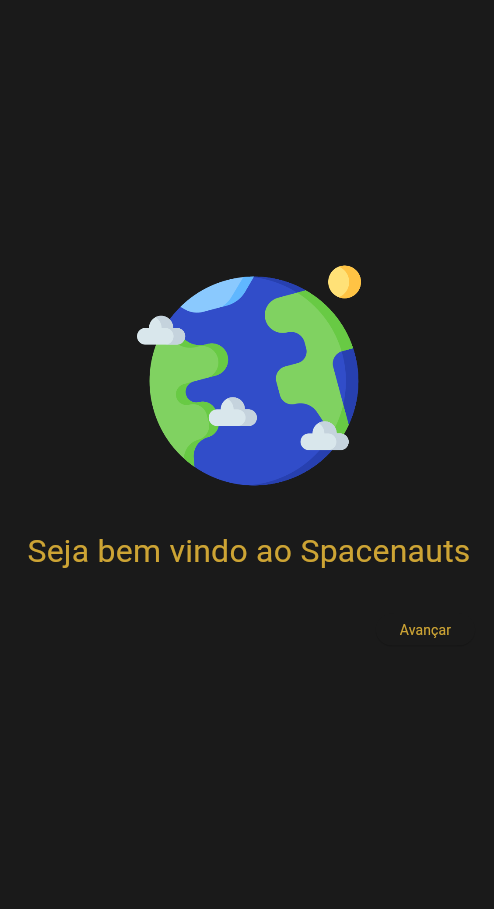
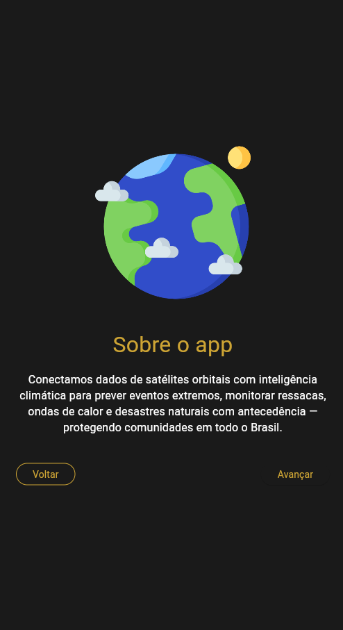
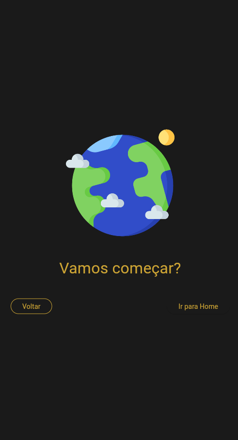
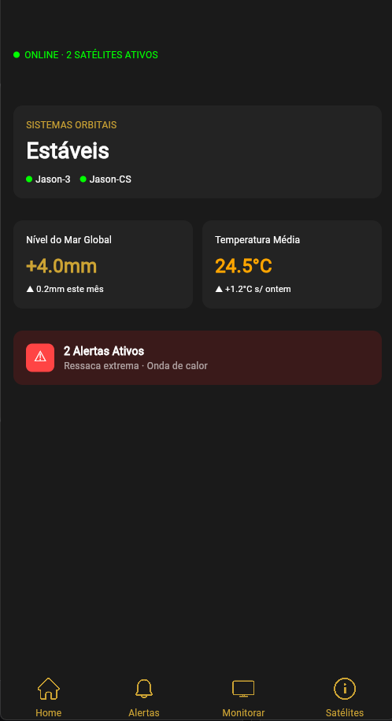
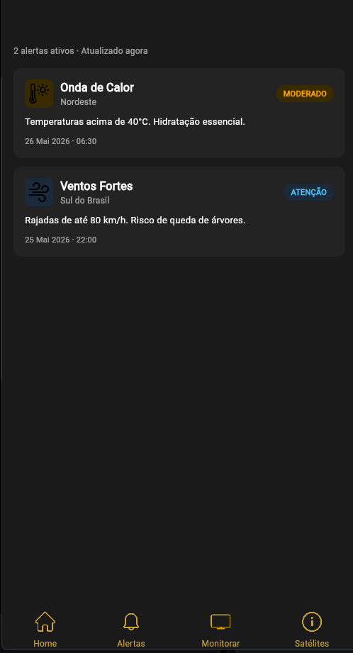
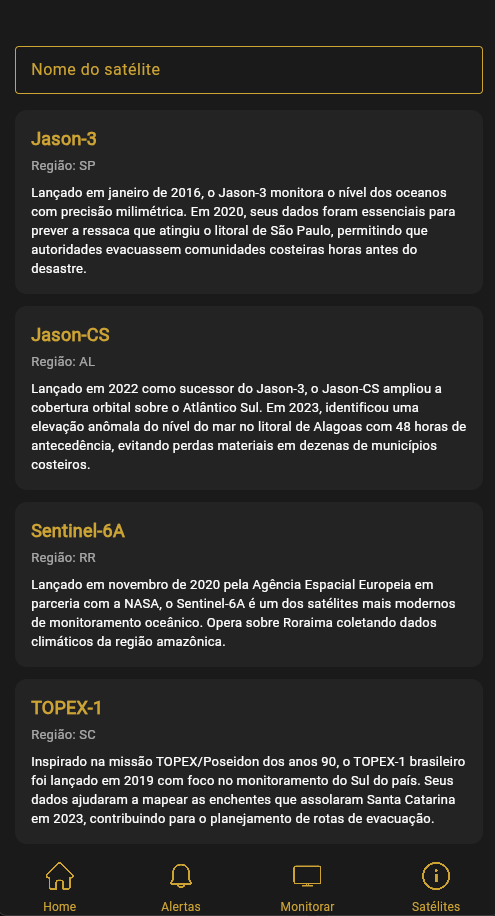
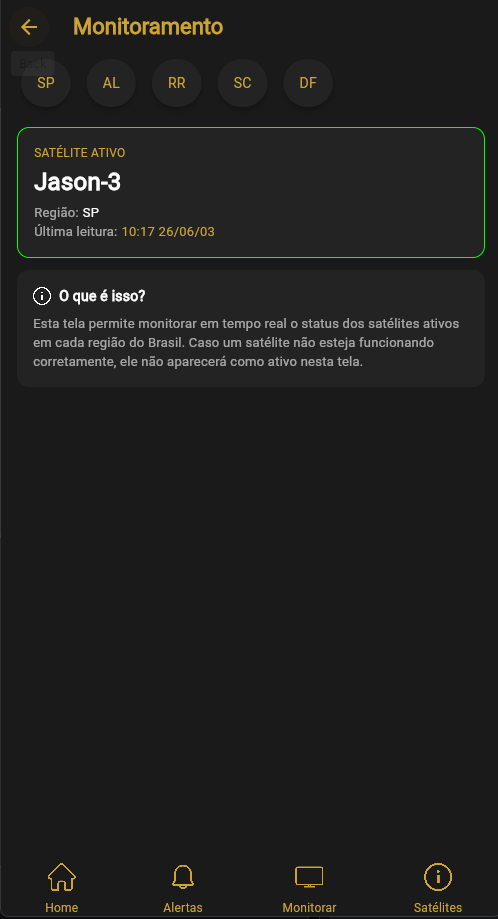

# 📱 Spacenauts

> ⚠️ **Nota Importante:** Este aplicativo utiliza **dados mockados** para todas as suas funcionalidades e exibições.
> 🛠️ **Tecnologias:** Desenvolvido de forma multiplataforma utilizando **Flutter** (Dart).
> 🔄 > 🔄 **Navegação:** A arquitetura de navegação foi implementada utilizando o sistema de rotas nomeadas (`onGenerateRoute`) do Flutter. O fluxo entre as telas e os componentes globais (como a `SpacenautsBottomBar`) é gerenciado de forma desacoplada através da passagem de callbacks (`VoidCallback`), garantindo uma arquitetura limpa e facilitando a manutenção do estado visual.

---

## 🗺️ Fluxo de Navegação (Figma)
Para entender a arquitetura de transição e o mapeamento de rotas do aplicativo nesta versão, veja o diagrama de fluxo abaixo:

  

---

## 📸 Telas do Aplicativo

Abaixo está a sequência cronológica de acesso às telas do aplicativo, iniciando pelo fluxo de introdução até a central de comandos (Home), de onde é possível navegar livremente entre os recursos principais.

### 1. Splash Screen
A porta de entrada do aplicativo. Responsável por carregar as configurações iniciais e exibir a identidade visual do projeto antes de direcionar o usuário para o onboarding.

  

### 2. Introdução 1 (Intro 1)
Primeira tela do fluxo de onboarding. Apresenta uma proposta de valor inicial do app e contextualiza o propósito da aplicação para o usuário.

  

### 3. Introdução 2 (Intro 2)
Segunda tela de onboarding, aprofundando os detalhes das ferramentas disponíveis e guiando o usuário sobre os benefícios de utilizar a plataforma.

  

### 4. Transição para Home (Intro to Home)
Tela que serve como ponte final do onboarding, preparando a experiência e fazendo a transição suave para a área principal pós-boas-vindas.

  

---

### 5. Home (Painel Principal)
O hub central do aplicativo. A partir desta tela, o usuário tem uma visão macro do sistema e pode acessar diretamente as três vertentes abaixo, além de retornar a ela facilmente a qualquer momento.

  

#### 🔄 Subtelas Acessíveis a partir da Home:

* **Alertas:** Central de notificações e avisos críticos gerados pelo sistema para tomada de ação rápida.
* **Informações de Satélite (Info Satélite):** Exibição detalhada de dados técnicos, conexões e telemetria espacial mockada.
* **Monitoramento:** Painel visual e analítico para acompanhamento em tempo real dos indicadores monitorados pelo app.

<table align="center">
  <tr>
    <td align="center"><b>Central de Alertas</b></td>
    <td align="center"><b>Informações de Satélite</b></td>
    <td align="center"><b>Painel de Monitoramento</b></td>
  </tr>
  <tr>
    <td></td>
    <td></td>
    <td></td>
  </tr>
</table>

---
